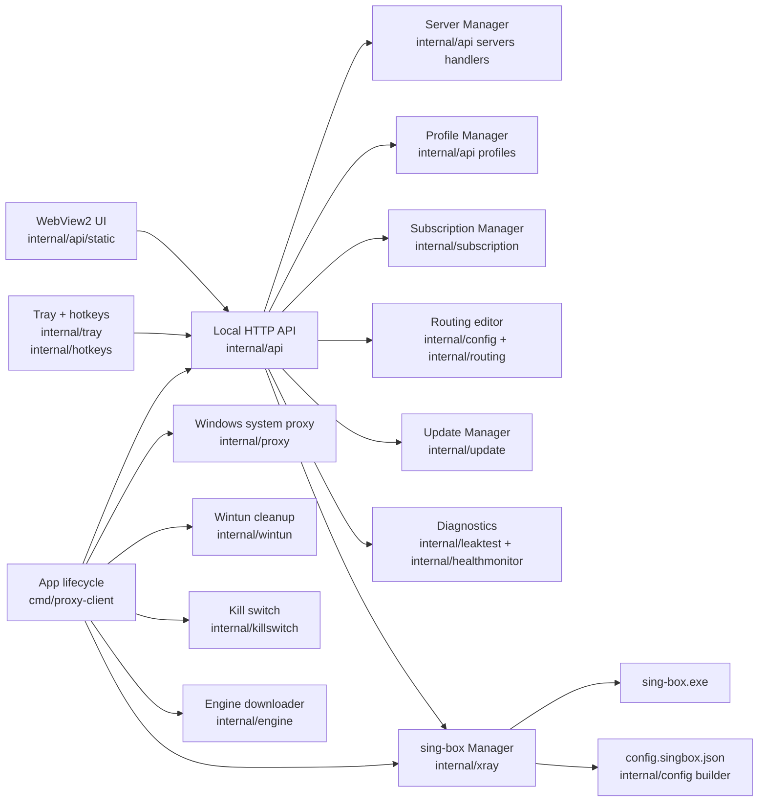
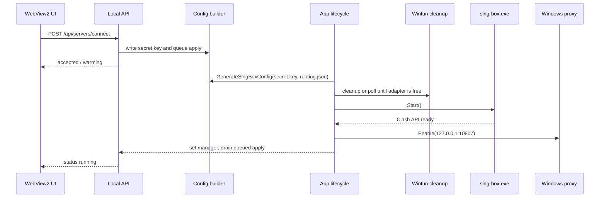
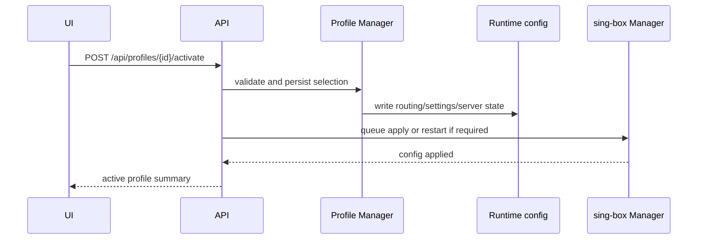
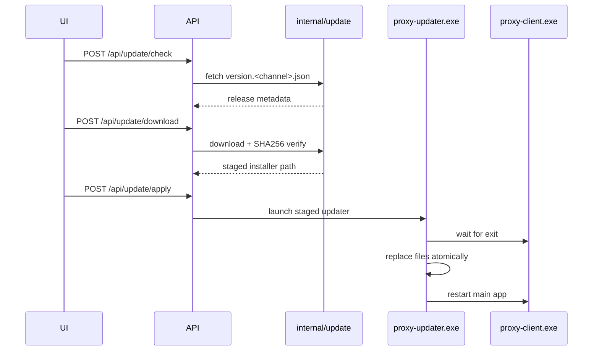
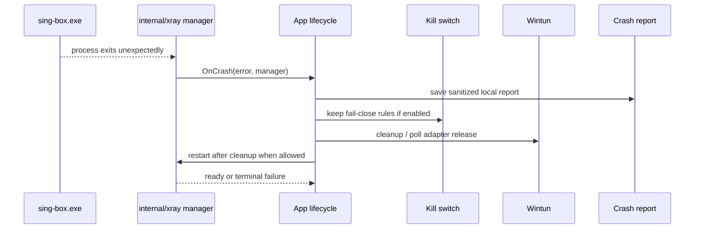
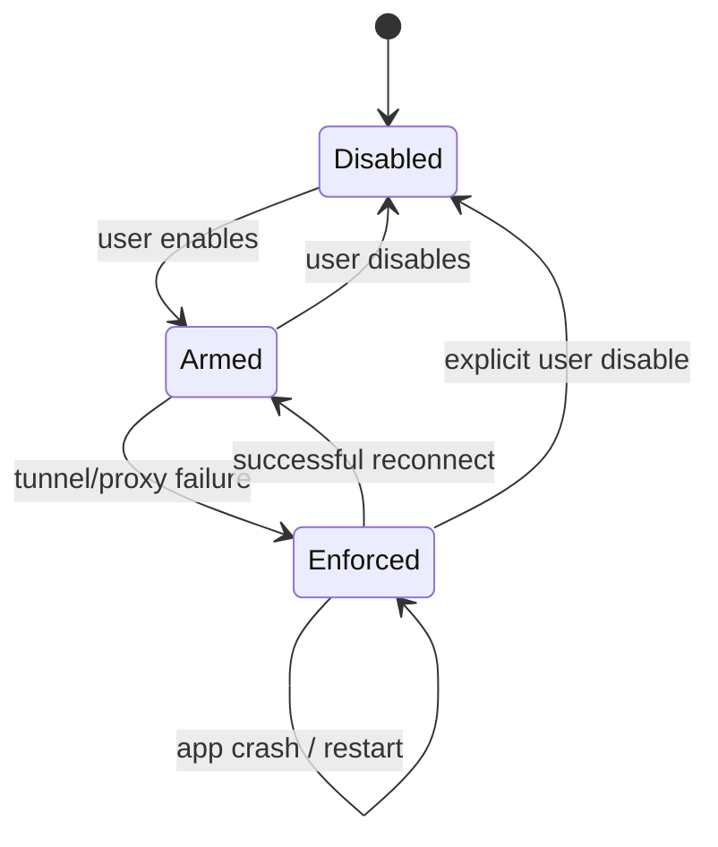

# SafeSky Proxy Client Architecture

**Module:** `proxyclient`
**Primary platform:** Windows 10/11 x64
**Core runtime:** `proxy-client.exe` + `sing-box.exe` + optional `proxy-updater.exe`

SafeSky is a Windows desktop client that configures and supervises `sing-box`.
The UI is a WebView2 frontend served by the local HTTP API on `127.0.0.1`.

## Overview

## Process Model

| Process | Owner | Purpose |
| --- | --- | --- |
| `proxy-client.exe` | `cmd/proxy-client` | Main GUI, API server, tray, lifecycle orchestration. |
| `sing-box.exe` | `internal/xray` | Network engine and proxy/TUN runtime. |
| `proxy-updater.exe` | `cmd/proxy-updater` | Stages and applies application updates after the main app exits. |

The main process owns user interaction, local state, and supervision. `sing-box`
is intentionally external: crashes are detected and recovered without taking
down the WebView2 shell.

## Runtime State

State lives next to the executable in the working directory. In development this
is normally the repository root; in packaged builds it is the install directory.

| Path | Owner | Notes |
| --- | --- | --- |
| `secret.key` | `internal/config`, server handlers | Active server URI. Contains credentials. |
| `config.singbox.json` | `internal/config` | Generated sing-box config. |
| `config.runtime.json` | API/TUN handlers | Runtime UI state. |
| `data/routing.json` | `internal/config` | Routing rules and DNS settings. |
| `data/app_settings.json` | `internal/config` | App settings, telemetry opt-in, language, hotkeys. |
| `data/app_rules.json` | `internal/apprules` | Per-application rules. |
| `data/profiles/` | profile handlers | Profile definitions and selected profile marker. |
| `data/subscriptions/` | `internal/subscription` | Encrypted subscription metadata and imported servers. |
| `data/dns_cache.db` | sing-box cache file | Persistent DNS cache. |
| `data/mtu_cache.json` | `internal/mtu` | Per-server MTU probe results. |
| `data/telemetry_id` | `internal/telemetry` | Anonymous telemetry id, created only after opt-in. |
| `data/crash-*.json` | `internal/crashreport` | Sanitized local crash reports pending upload. |
| `data/killswitch_state.json` | `internal/killswitch` | Kill switch recovery state. |

## Connect Flow

## Profile Switch Flow

## Auto-Update Flow

## Crash And Recovery Flow

## Kill Switch State Machine

Kill switch policy is intentionally fail-close. See
[KILLSWITCH_POLICY.md](KILLSWITCH_POLICY.md) for the product decisions.

## Module Boundaries

| Package | Responsibility |
| --- | --- |
| `cmd/proxy-client` | Wires application lifecycle, logging, tray, API, sing-box manager, startup recovery. |
| `internal/api` | Local REST API, WebView2 static assets, handlers, route setup. |
| `internal/config` | Parses server URIs and builds sing-box JSON. |
| `internal/xray` | Starts, stops, restarts, and monitors `sing-box.exe`. |
| `internal/engine` | Downloads and verifies the `sing-box.exe` runtime. |
| `internal/update` | Checks, downloads, verifies, and stages SafeSky app updates. |
| `internal/subscription` | Fetches subscription URLs, parses supported server entries, stores encrypted metadata. |
| `internal/killswitch` | Windows firewall/WFP kill switch state and recovery. |
| `internal/wintun` | Wintun adapter cleanup, startup probes, and adaptive wait timing. |
| `internal/telemetry` | Opt-in event upload, privacy export/delete, sanitized crash report upload. |
| `internal/mtu` | Binary MTU probing support and per-server MTU cache. |

## Dependency Rules

Application code may import every layer. Lower-level packages should stay narrow:

- `internal/config` must not depend on the API or UI.
- `internal/xray` supervises a process but does not own UI state.
- `internal/api` receives external dependencies through `api.Config`.
- Windows-specific packages must provide `*_other.go` stubs for cross-builds.

## Testing Strategy

| Area | Required checks |
| --- | --- |
| API handlers | `httptest`, strict JSON decoding, race tests. |
| Config builder | Unit tests, golden tests, and `sing-box check` where available. |
| Windows platform code | Windows build + non-Windows stubs. |
| Lifecycle/concurrency | `go test -race`; goroutines must stop through context or done channels. |
| Security-sensitive paths | Path traversal tests, secret masking tests, gosec in CI. |
